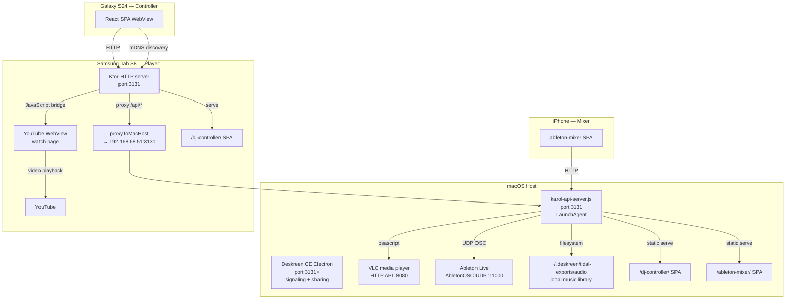

# Karol Architecture

## System Overview



## Component Responsibilities

### karol-api-server.js (Mac, port 3131)
- **Authority** for all Karol API routes: YouTube DJ, VLC, Ableton
- VLC HTTP API bridge (`/api/vlc-dj/*`)
- AbletonOSC UDP bridge (`/api/ableton/*`)
- Serves DJ controller SPA (`/dj-controller/`)
- Serves Ableton mixer SPA (`/ableton-mixer/`)
- Managed by LaunchAgent: `~/Library/LaunchAgents/com.karol-api.plist`

### Deskreen CE Electron (Mac, auto-selects port)
- Legacy screen sharing and Socket.IO signaling
- `discover.json` / `health.json` for device discovery
- **Delegates** Ableton/VLC to karol-api-server.js

### Ktor HTTP Server (Tab S8, port 3131)
- Serves DJ controller SPA
- Proxies `/api/*` to Mac backend
- Manages YouTube WebView lifecycle
- Injects `youtubeWatchLayout.js` for playback control

### DJ Controller SPA (React + Vite)
- 5 tabs: Player, Queue, Add, Playlists, VLC
- YouTube queue/playlist management
- VLC library browser and queue
- Drag-and-drop reordering (`@dnd-kit`)
- Client-side playback clock for low-latency seek display

### Ableton Mixer SPA (vanilla JS)
- iPhone landscape-optimized mixer
- Track volume, pan, mute, solo, sends, meters
- Master fader, tempo (tap tempo)
- 500ms polling with 80ms input debounce

## Data Flow

### YouTube DJ Flow
```
S24 POST /api/youtube-dj/queue → S8 proxy → Mac JS server → YouTube playlist sync
S8 WebView: youtubeWatchLayout.js monitors <video> events → JSON state → S8/Ktor → S24 polls
```

### VLC Flow
```
S24 POST /api/vlc-dj/queue → S8 proxy → Mac JS server → osascript VLC
Mac: osascript queries VLC state → JSON → S24 polls /api/vlc-dj/status
Cover art: /api/vlc-dj/cover?path=FILE → serves embedded album art from audio files
```

### Ableton Flow
```
S24 POST /api/ableton/track/0/volume → S8 proxy → Mac JS server → UDP OSC → AbletonOSC
Mac JS server polls Ableton state via OSC queries → cachedAbletonState → /api/ableton/mixer-state
iPhone mixer SPA: 500ms poll /api/ableton/mixer-state → render track strips
```

## Session Persistence

```
Tab S8:
  YouTube cookies → Android EncryptedSharedPreferences
  Backup: /sdcard/Downloads/Deskreen/deskreen-youtube-session.json

Mac:
  YouTube session: .deskreen/youtube-session.json (gitignored)
  Scripts: player:save-youtube-session / player:restore-youtube-session
```
